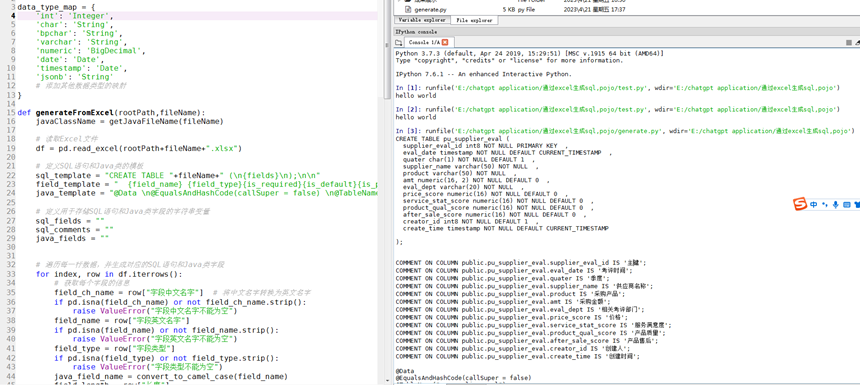

早就听说chatgpt如何强大，说的很邪乎，我作为程序员怎能不尝试一下

那做什么呢？今天花了一天时间用chatgpt 做了个小工具，既能提高工作效率，又能跟c老师学习，perfect！

先抛给c老师我的需求，这个功能其实挺简单：


它告诉我要用python写，跟我预料的一样，python的pandas类库还是很强大的。

以前我也想要学python，用python做一些东西。但是由于懒，觉得学习成本太高，迟迟没有开始。

现在有了c老师的帮助，这事变得简单了。

接下来首先需要安装python环境，pandas库和IDE。此处省略一万字。

接下来试一下安装是否成功：


自己就会这一句。剩下的就要c老师帮我了。

把上面的脚本放到我本地执行，报错了！看来ChatGPT不能完全取代人，还是得需要程序员。

我的excel长这样：


原来是得把脚本里列名改成excel里对应的

c老师给的脚本是把结果打印在控制台上，但是我想输出到文件。于是我问


接着我让它帮我写了几个方法


在如何判断某一个格内容是否为空时，卡了一段时间，c老师给了好几种方法，我试了都有问题。最后发现需要用pandas找到这一列然后再判断非空，才可以。


其实本来我还想再做一个功能，根据字段中文名 由脚本翻译成 字段英文名。翻译需要引入translate库，但是这个库能翻译简单的词，复杂的就不行了
会报错。所以就算了 不费那劲了。

后续完善准备加上dao，增删改查等方法

这是运行结果，基本满足要求：



```python
import pandas as pd   

data_type_map = {
    'int': 'Integer',
    'char': 'String',
    'bpchar': 'String',
    'varchar': 'String',
    'numeric': 'BigDecimal',
    'date': 'Date',
    'timestamp': 'Date',
    'jsonb': 'String'
    # 添加其他数据类型的映射
}

def generateFromExcel(rootPath,fileName):
    javaClassName = getJavaFileName(fileName)

    # 读取Excel文件
    df = pd.read_excel(rootPath+fileName+".xlsx")

    # 定义SQL语句和Java类的模板
    sql_template = "CREATE TABLE "+fileName+" (\n{fields}\n);\n\n"
    field_template = "  {field_name} {field_type}{is_required}{is_default}{is_primary_key} " 
    java_template = "@Data \n@EqualsAndHashCode(callSuper = false) \n@TableName(\""+fileName+"\") \n@ApiModel(value = \""+javaClassName+"对象\" ) \npublic class "+javaClassName+" implements Serializable {{\n{fields}\n}}"

    # 定义用于存储SQL语句和Java类字段的字符串变量
    sql_fields = ""
    sql_comments = ""
    java_fields = ""


    # 遍历每一行数据，并生成对应的SQL语句和Java类字段
    for index, row in df.iterrows():
        # 获取每个字段的信息
        field_ch_name = row["字段中文名字"]  # 将中文名字转换为英文名字
        if pd.isna(field_ch_name) or not field_ch_name.strip():
            raise ValueError("字段中文名字不能为空")
        field_name = row["字段英文名字"] 
        if pd.isna(field_name) or not field_name.strip():
            raise ValueError("字段英文名字不能为空")
        field_type = row["字段类型"]
        if pd.isna(field_type) or not field_type.strip():
            raise ValueError("字段类型不能为空")
        java_field_name = convert_to_camel_case(field_name)
        field_length = row["长度"]
        if pd.isna(field_length):
            field_length = ''
        if field_type == 'int' and field_length == 8:
            java_field_type = 'Long'
        else:
            java_field_type = data_type_map.get(field_type)

        _field_type = '' 
        _is_required = ''
        _is_default = ''
        _is_primary_key = ''
        is_primary_key = row["是否主键"]
        precision = row["字段精度"]
        if pd.isna(precision):
            precision = ''
        _field_type = get_field_type(field_type,field_length,precision)

        is_required = row["是否必填"]
        if pd.notna(is_required) and is_required == '是':
            _is_required = "NOT NULL "
        else:
            _is_required = "NULL " 
        if pd.notna(row["默认值"]) :
            is_default = row["默认值"]
            _is_default = f'DEFAULT {is_default} '
        if pd.notna(row["是否主键"]) and row["是否主键"] == '是':
            _is_primary_key = "PRIMARY KEY "

        # 生成SQL语句中的字段信息
        sql_fields += field_template.format(
            field_name = field_name,
            field_type = _field_type, 
            is_required = _is_required,
            is_default = _is_default,
            is_primary_key = _is_primary_key
        ) 
        if index < len(df)-1:
            sql_fields += ",\n"
        else:
            sql_fields += "\n";

        # sql 注释
        sql_comments += "COMMENT ON COLUMN public."+fileName+"."+field_name +" IS '" +field_ch_name+"';\n"

        # 生成Java类中的字段信息
        java_fields += "\n  @ApiModelProperty(value = \""+field_ch_name+"\")\n"
        if is_primary_key == '是':
            java_fields += "  @TableId(value = \""+field_name+"\", type = IdType.ASSIGN_ID)\n"
        java_fields += "  private {field_type} {field_name};\n".format( 
            field_type=java_field_type,
            field_name=java_field_name
        )

    # 生成完整的SQL语句和Java类
    table_name = fileName 
    sql_script = sql_template.format(table_name=table_name, fields=sql_fields) 
    java_class = java_template.format(class_name=javaClassName, fields=java_fields)

    # 输出结果
    print(sql_script)
    print(sql_comments)
    print(java_class)
    pre_sql_script = "DROP TABLE IF EXISTS "+fileName+";\n\n";

    # 将输出结果保存到文件
    with open(rootPath+fileName+".sql", "w") as sql_file:
        sql_file.write(pre_sql_script+sql_script+sql_comments)
    with open(rootPath+javaClassName+".java", "w") as java_file:
        java_file.write(java_class)

def get_field_type(data_type, data_length=None, precision=None):  
    if data_length!='':
        data_length = f"{data_length:.0f}"
    if precision!='':
        precision = f"{precision:.0f}"
    if data_type == 'int':
        return f'int{data_length} '
    elif data_type == 'char':
        return f'char({data_length}) '
    elif data_type == 'varchar':
        return f'varchar({data_length}) '
    elif data_type == 'numeric':
        if precision=='':
            return f'numeric({data_length}) '
        else:
            return f'numeric({data_length}, {precision}) '
    elif data_type == 'date':
        return 'date '
    elif data_type == 'timestamp':
        return 'timestamp '
    elif data_type == 'jsonb':
        return 'jsonb '
    return None


def convert_to_camel_case(text):
    # 将下划线去掉，并将每个单词的首字母大写
    words = text.split("_")
    capitalized_words = [word.capitalize() for word in words]

    # 将单词连接起来，并将第一个单词的首字母小写
    camel_case = ''.join(capitalized_words) 
    camel_case = camel_case[0].lower() + camel_case[1:]
    return camel_case

def getJavaFileName(text):
    t = convert_to_camel_case(text)
    return t[0].upper() + t[1:]

## 调用方法 
generateFromExcel("E:/chatgpt application/通过excel生成sql,pojo/","pu_supplier_eval")

#print(get_field_type('numeric',16,''))
```

## 调用方法

generateFromExcel("E:/chatgpt application/通过excel生成sql,pojo/","pu_supplier_eval")

#print(get_field_type('numeric',16,''))

这个小脚本花了我一整天时间，这一天工作没怎么干，一直在调试。给我感觉ChatGPT可以提高效率，可以帮助人去做之前不能，不会做的事情。但是也需要人来检验它写的程序，是否有问题。不过听说新出了个autoGPT，更加强大，那就不知道了。
